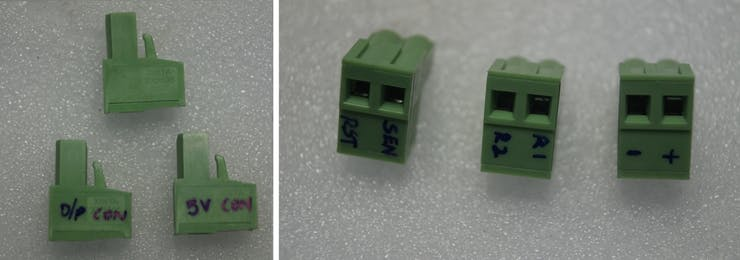
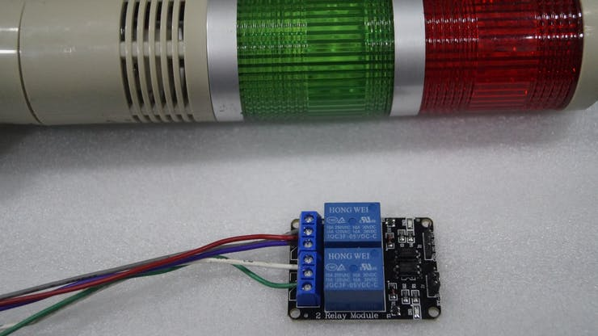

# Security-System-with-Motion-Detection

The system is designed to detect intrusion (unauthorized entry ) into a building or other area. This project can be used in residential, commercial, industrial, and military properties for protection against burglary or property damage, as well as personal protection against intruders

## Why Did We Build This?

There is a lot of theft scenarios nowadays which causes a great loss to the owner. A recent incident at a popular jewellery shop urged me to do this project.


"A jewellery store in Tamil Nadu’s Tiruchirappalli district was burgled in the early hours of Wednesday morning after masked men gained entry into the store by drilling a hole in its wall. The incident took place at ####### Jewellery, a three-storeyed building near Chathiram bus Stand in Tiruchirappalli.

Diamond, Gold and Platinum jewellery worth 13 crore rupees were stolen from the store. I am satisfied with the way the investigation is being carried, the robbers will be caught soon" - Source from Indian Express

## Idea 💡
The system is designed to detect intrusion (unauthorized entry ) into a building or other area. This project can be used in residential, commercial, industrial, and military properties for protection against burglary or property damage, as well as personal protection against intruders

A compact, low profile project is attached to the wall of the area which has to be monitored. This project consists of a camera that will capture the image of the intruder and notify the owner.

To test the real-time scenario, we deployed it on one of the jewelry shops to test how possibly it could help them and the results were pretty affirmative.

[](https://www.youtube.com/watch?v=kC7vu-Tcuws "Working of the Project - Click to Watch!")


## Requirements

### Hardware

* KEMET Electronics Corporation Proximity Sensor- Pyroelectric Infrared Sensor Module
* Raspberry Pi Zero
* Raspberry Pi Camera v2 or USB Camera
* Relay breakout board
* LED x 2
* Buzzer
* Push Button

### Software

*   Raspberry Pi - Raspbian
*   OpenCV

## Getting Started with Pyroelectric Proximity Infrared Sensors (Content from KEMET)
KEMET Electronics Pyroelectric Proximity Infrared Sensor Modules use the pyroelectric proximity effect of ceramic by absorbing infrared rays emitted from the human body. This detects the natural infrared signature produced by humans. It can detect infrared rays without using lenses, allowing a detection distance up to 2 meters. By adding a KEMET proprietary lens, the detection distance can be further improved up to 5 meters. The lens is available in three different colors, to enable some design flexibility. KEMET Electronics Pyroelectric Proximity Sensor Modules in the module solution are even easier to install with the driving being already included in the package, making it just "plug and sense".


### FEATURES

* Reflow capable SMD configuration
* Lens not required
* Wide view angle up to ±60°
* Detection possible through glass or resin
* Low power consumption, down in the μA range
* Excellent radio wave performance in a high-frequency band
* Compact and low profile (5.0 x 4.8 x 1.7mm)
* Human presence detection sensing for energy-saving functions in a variety of applications

### APPLICATIONS

* Contactless switching
* Office automation equipment
* Home appliances
* Lighting
* Display products
* Air-conditioners
* TVs
* PC monitors
* Rice cookers
* Smart toilets
We use the sensor with a white lens which gives a 74° view angle and the range up to 5m.

## Burn Raspbian to the SD card

Raspbian is the Linux distribution of choice running on the Raspberry Pi. In this guide, we will be using the Lite version, but the Desktop version (which comes with a graphical environment) can be used as well.

* Download Etcher and install it.
* Connect an SD card reader with the SD card inside.
* Open Etcher and select from your hard drive the Raspberry Pi .img or .zip file you wish to write to the SD card.
* Select the SD card you wish to write your image to.
* Review your selections and click 'Flash!' to begin writing data to the SD card

### Connect the device to your network

* Enable SSH access by adding empty file ssh, again placed at the root of the boot volume on your SD card.
* Insert the SD card into the Raspberry Pi. It will boot in roughly 20 seconds. You should now have SSH access to your Raspberry Pi. By default, its hostname will be raspberrypi.local.

On your computer, open a terminal window and type the following:
```
ssh pi@raspberrypi.local
```
The default password is **raspberry**

## Interfacing with Raspberry Pi (Project Motion Dashcam)

## KEMET's PYROSENSOR - SS430

The Block Diagram of this circuit is given below.


To make these connections, I've used separate connectors for power, relay output, and sensor input. Each connector is soldered to the Raspberry Pi as shown below.




Since the output from the pyro sensor is a digital signal, we connect the KEMET pyro sensor to the GPIO Pin 15 of Raspberry Pi.


The Pinout of the SS-430 pyroelectric sensor is given below


The connection is made as shown below.

| SS-430            |  Raspberry Pi |
|-----------------------|---------------|
| Vcc |  +5V |
| Signal (4) |  GPIO15 |
| GND |  GND |


### PI-CAMERA

The Pi-camera is connected to the CSI port of the Raspberry Pi.


### RELAY BOARD

We connect the Buzzer and an Emergency light using a relay circuit to the GPIO pins 23 & 24 of the Raspberry Pi.


The Power Supply is used to deliver the power for the Status Light, Emergency Light, and the Alarm.


The Industrial grade Light Indicators and Buzzer are used to show the status and alert signal to the security (user).



| Relay Board            |  Raspberry Pi  |
|-----------------------|---------------|
| Vcc |  +5V |
| IN1 (Pass Light) |  GPIO23 |
| IN2 (Alert Light & Buzzer) |  GPIO24 |
| GND |  GND |

The Industrial grade Light Indicators and Buzzer are connected to the GPIOs of the Raspberry Pi.

### PUSH BUTTON

The Emergency reset button is connected to the GPIO pin 14 of the Raspberry Pi.


The emergency button is used to turn off the alert manually by pressing it once.

The Overall connection is shown below.


## Code
GPIO of the Raspberry Pi can be accessed using the GPIO library which can be imported using the GPIO library.

The libraries such as RPi.GPIO and time are used in this project.
```
import RPi.GPIO as GPIO 
import time
```
The GPIO pin is then configured to digital input using the following lines
```
sensorPIN = 15
GPIO.setmode(GPIO.BCM)
GPIO.setup(sensorPIN, GPIO.IN)
```
GPIO Pin 15 is configured to use as digital input which reads for every 50ms. Whenever the intruder/human enters in the range, the sensor detects and produces the digital pulse.
```
while True:           
    if GPIO.input(sensorPIN): # if sensorPIN == 1
        print "Intruder Alert !!!"
    else:
        print "No intruder"
    time.sleep(0.05)         # wait 50 milliseconds
 ```
Although the above code worked, I had a few false triggering. After going through the documentation from KEMET, The SS-430 produces two output pulses of 200msec per detection. This can be interpreted by the Raspberry pi using the following code:


```
import RPi.GPIO as GPIO
import time
sensorPIN = 15
GPIO.setmode(GPIO.BCM)
GPIO.setup(sensorPIN, GPIO.IN)
pulse = 0
PyroRead = 0
IR_threshold = 198000
IR_sensed = 0
start_time = 0
end_time = 0
try:
    while True:
        while(IR_sensed < 2):
            start_time = time.time()
            GPIO.wait_for_edge(sensorPIN, GPIO.FALLING)
            GPIO.wait_for_edge(sensorPIN, GPIO.RISING)
            GPIO.wait_for_edge(sensorPIN, GPIO.FALLING)
            end_time = time.time()
            PyroRead = round((end_time - start_time)*1000000)
            print(PyroRead)

            if(PyroRead > IR_threshold):
                IR_sensed += 1
        pulse = pulse + 1
        print(pulse)
        print("Intruder Alert !!!")
        PyroRead = 0
        IR_sensed = 0
        time.sleep(1)         # wait 1 second
finally:
    print("clean up")
    # GPIO.cleanup([sensorPIN])
    GPIO.cleanup() # cleanup all GPIO
```
 
Now the sensor can determine the presence of the human within the specified range and view angle.


After a lot of struggles and effort, I have created a library to interface KEMET's pyro sensor with the Raspberry Pi.

The **picamera library** is installed using the following command
```
sudo apt-get install python-picamera
```


Next, we interface the Raspberry Pi Camera Module V2 to the Raspberry Pi. We import picamera library to interface the camera with the raspberry pi. We have set the resolution of the camera at 1024 x 768 so that the images are captured at a lower resolution. This allows us to reduce memory usage and to send the images.
```
import picamera

with picamera.PiCamera() as camera:
	camera.resolution = (1024, 768)
```
When the intruder is detected, the event is triggered and the system captures the images of the intruder. The images captured are stored in a folder with the timestamp attached to it.
```
with picamera.PiCamera() as camera:
	camera.resolution = (1024, 768)
	for filename in camera.capture_continuous('/home/pi/Intruder/img{timestamp:%H-%M-%S-%f}.jpg'):
```


From the above example, the picture of the intruder is captured by the device which has to be transmitted to the master (owner).

First, we add the **Smtplib** package allows us to set up the Gmail server. Install an SMTP service with the command
```
sudo apt-get install ssmtp
```


Make sure that Allow less secure apps setting is turned on for allowing Gmail SMTP Access Authentication.

```
import glob
import smtplib
import os
```
These four modules are used to send the emails from a Raspberry Pi:
```
from email.mime.multipart import MIMEMultipart
from email.mime.base import MIMEBase
from email.mime.text import MIMEText
from email.utils import formatdate
from email import encoders
```
We need to add the receiver's email and sender's email address and password, in our case both, are the same email as shown below:
```
sender = 'x@gmail.com'
password = ' Replace the pass '
receiver = 'x@gmail.com'
```
By making several adjustments to the code, you can change the Subject, sender address, receiver address, and the content of the body. The images are sorted and the latest image is sent via Gmail (SMTP).


We have also added two relay circuit and a manual reset push button to the circuit. These are treated as normal GPIO to indicate or to inform the status of the theft alert using LED and Buzzers.

```
# Set pins 23, 24 to be an output pin and set initial value to low (high), since relay ckt is pull-down mechanism
Green = 23
Red = 24
GPIO.setup(Green, GPIO.OUT, initial=GPIO.HIGH) 
GPIO.setup(Red, GPIO.OUT, initial=GPIO.HIGH) 

# Set pin 14 to be an input pin
reset_button = 14
GPIO.setup(reset_button, GPIO.IN)

while True:           
    if GPIO.input(sensorPIN): # if sensorPIN == 1
        GPIO.output(23, GPIO.HIGH) # Turn off Green
        GPIO.output(24, GPIO.LOW) # Turn on Red
        if !GPIO.input(reset_button):
            break
    else:
        GPIO.output(23, GPIO.LOW) # Turn on Green
        GPIO.output(24, GPIO.HIGH) # Turn off Red
    sleep(0.05)         # wait 50 milliseconds
```
## Enclosure
* I had used the raspberry pi zero enclosure for this project.


* A small section is needed to attach the SS-430 pyro sensor to the project. I have adhered the sensor to the Indicator firmly as shown below.


* Make sure that the required wires/connects are soldered to the raspberry pi. This is a crucial part to meet the size of the device. I have used the terminal block connector to make the common connections. One end of the wires is soldered to the Raspberry Pi.


* Now Insert the device inside the enclosure and It would look something like this


Voila! The connection is done and we are equipped to test it.

## Working of the Project 🔭
To test the real-time scenario, we deployed it on one of the jewelry shops to test how possibly it could help them and the results were pretty affirmative. https://www.youtube.com/watch?v=kC7vu-Tcuws
 
[](https://www.youtube.com/watch?v=kC7vu-Tcuws "Working of the Project - Click to Watch!")


**If you faced any issues in building this project, feel free to ask me. Please do suggest new projects that you want me to do next. **

**Share this video if you like. **

**Happy to have you subscribed: https://www.youtube.com/c/rahulkhanna24june?sub_confirmation=1 **

**Thanks for reading! **
